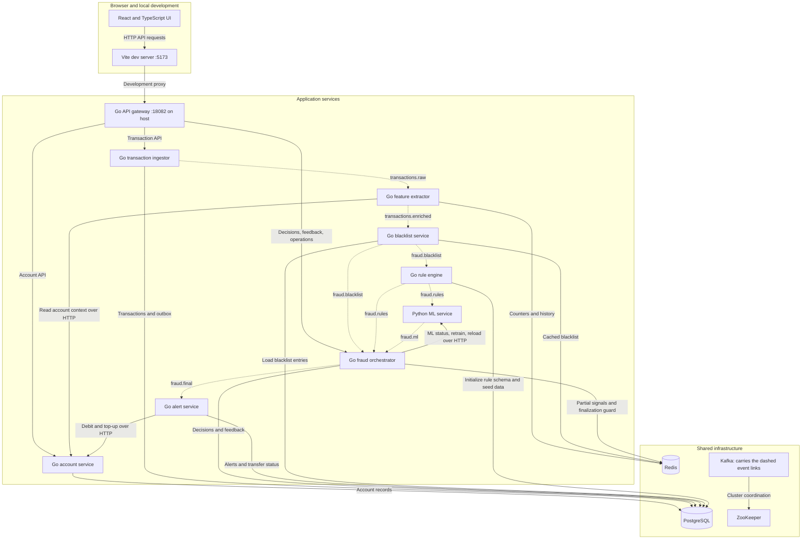
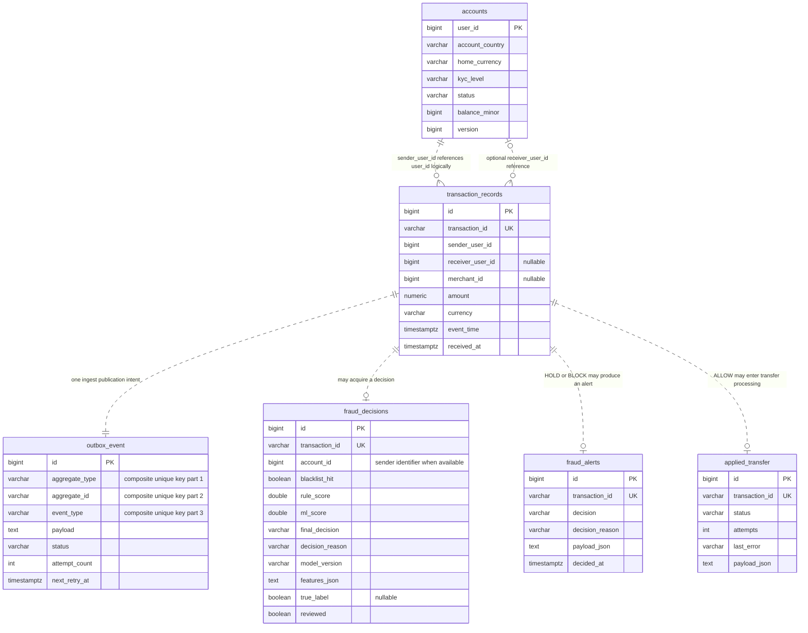

# SentinelPay architecture

These diagrams describe the current implementation: its component connections, core data model, and transaction-processing sequence.

The diagrams use Mermaid. Open this document in a Mermaid-capable Markdown viewer to render them.

- [Component connections](#1-component-connections--what-talks-to-what)
- [Data model](#2-data-model--what-is-stored-and-connected)
- [Transaction sequence](#3-transaction-sequence--what-happens-over-time)

## 1. Component connections — what talks to what?

**Solid arrows:** HTTP requests or storage access. **Dashed arrows between application services:** events delivered through Kafka, with the topic on the arrow. These are logical subscriptions, not direct service-to-service network calls. Kafka is drawn separately as the infrastructure carrying those dashed links.



**How to explain it:** “The UI talks through a gateway. HTTP handles user requests and account operations. Kafka connects the fraud-processing stages. PostgreSQL keeps business records; Redis holds behavioral and temporary state.”

**Count:** ten application components: the UI, eight Go services, and Python ML. Four infrastructure components: PostgreSQL, Redis, Kafka, ZooKeeper. Vite is development tooling; the one-off `kafka-init` helper is omitted. Gateway health routes, alert reads, operational probes, and offline training dependencies are omitted to keep the main paths readable.

**Two important details:** rules skip blacklist hits, and ML skips non-GRAY rule results. A service subscribing to an event does not mean it always performs scoring on that event. The rules table is initialized, but the active evaluator uses Go-coded rules.

**Read the edges in code:** [gateway routes](../cmd/api-gateway/main.go), [Kafka topic contracts](../internal/contracts/kafka.go), [rule worker](../internal/rules/worker.go), [ML loop](../microservices/ml-services/fraud-ml-service/inference/main.py), [orchestrator worker](../internal/orchestrator/worker.go), [Compose](../docker-compose.yml).

## 2. Data model — what is stored and connected?

This is the **core logical model**, with selected fields rather than every column. `PK` marks a primary key; `UK` marks a unique field. Dashed relationships show expected business associations. **They are not declared foreign keys, and the database does not enforce the existence/cardinality of the associated parent record.** For example, a sender ID can be present without an enforced account reference.



**How to explain it:** “User IDs identify accounts. The transaction ID identifies the business operation across the request, outbox, decision, alert, and transfer record. A database row ID is local identity; the transaction ID is how I trace the workflow.”

The one-to-one outbox association describes the current `TRANSACTION` / `TransactionReceived` intent created atomically during ingest. Its schema is more general: other aggregate/event-type combinations could allow additional events per business object. The finalization path currently saves the decision and publishes separately; it does not have a decision outbox yet.

Additional tables, separate from the core transaction relationships:

| Table | Important fields | Purpose |
|---|---|---|
| `blacklist_entries` | `id`, `type`, `value`, `active`; unique `(type, value)` | Source entries used to populate blacklist cache |
| `fraud_rules` | `id`, unique `name`, `type`, `threshold`, `weight`, `active` | Stored rule data; does not establish dynamic evaluation |

**Redis is not represented as SQL tables.** It holds velocity counters, device/contact history, blacklist keys, 15-second aggregation state, and a two-minute finalization guard. Those lifetimes and structures matter to failure recovery.

**Current deployment:** these SQL tables share one PostgreSQL database in root Compose. They have different service owners, not separate physical database deployments.

**Read the schemas:** [accounts](../internal/account/postgres.go), [transactions/outbox](../internal/ingest/postgres.go), [decisions](../internal/orchestrator/postgres.go), [alerts/transfers](../internal/alert/postgres.go), [blacklist](../internal/blacklist/postgres.go), [rules](../internal/rules/postgres.go).

## 3. Transaction sequence — what happens over time?

This traces the **GRAY → ML → HOLD path** exercised in the local demo. Gateway forwarding is omitted here because diagram 1 already covers it. The relay is background work inside the ingestor service, not a tenth backend service. The PostgreSQL participant represents the shared database; tables are named in messages.

The chart shows one normal processing order. Independent topic consumers can let the orchestrator observe ML before its rule event; the handlers support either order while aggregation state exists. The 202 response and background relay activity are independent after the ingest commit, so their precise network-visible order is not guaranteed.

```mermaid
sequenceDiagram
    autonumber
    participant ui as React UI
    participant ingest as Ingestor HTTP
    participant db as PostgreSQL
    participant relay as Ingestor relay
    participant kafka as Kafka
    participant feature as Feature extractor
    participant account as Account service
    participant redis as Redis
    participant blacklist as Blacklist service
    participant rules as Rule engine
    participant ml as Python ML
    participant orchestrator as Orchestrator
    participant alert as Alert service

    ui->>ingest: POST transaction through gateway
    ingest->>ingest: Validate and check transaction identity
    ingest->>db: BEGIN; insert transaction and outbox; COMMIT
    db-->>ingest: Both rows committed
    ingest-->>ui: 202 Accepted

    relay->>db: Fetch due PENDING outbox rows
    db-->>relay: Transaction event
    relay->>kafka: Publish transactions.raw
    kafka-->>relay: Producer acknowledgment
    relay->>db: Mark outbox SENT

    kafka-->>feature: Consume transactions.raw
    feature->>account: Read sender and receiver context over HTTP
    account-->>feature: Account snapshots
    feature->>redis: Update counters and read history
    redis-->>feature: Behavioral features
    feature->>kafka: Publish transactions.enriched

    kafka-->>blacklist: Consume enriched transaction
    blacklist->>redis: Check blacklist keys
    redis-->>blacklist: No blacklist hit in this example
    blacklist->>kafka: Publish fraud.blacklist
    kafka-->>orchestrator: Consume blacklist result
    orchestrator->>redis: Store transaction snapshot and partial state
    kafka-->>rules: Consume non-hit blacklist result
    rules->>rules: Evaluate rules: score 0.40, band GRAY
    rules->>kafka: Publish fraud.rules

    kafka-->>orchestrator: Consume GRAY rule result
    orchestrator->>redis: Store rule signal; check for ML score
    kafka-->>ml: Consume GRAY rule result
    ml->>ml: Score with loaded model
    ml->>kafka: Publish fraud.ml with score and version
    kafka-->>orchestrator: Consume ML score near 0.50
    orchestrator->>redis: Read partial signals; set finalization guard
    orchestrator->>db: Save HOLD decision with explanation
    orchestrator->>kafka: Publish fraud.final
    kafka-->>alert: Consume HOLD decision
    alert->>db: Save fraud_alerts record

    loop Until available or UI polling stops
        ui->>orchestrator: GET decision through gateway
        orchestrator->>db: Find by transaction_id
        db-->>orchestrator: Stored decision if available
        orchestrator-->>ui: Decision or 404 while missing
    end
```

**How to explain it:** “The request finishes after the transaction and outbox commit. The background pipeline enriches and evaluates the transaction. A borderline rule result goes to ML, the orchestrator saves HOLD, and the alert service records it. The UI polls independently; it does not wait for the alert service to finish.”

The polling loop is drawn at the bottom for readability. It actually begins after acceptance and overlaps processing. Consumer offset commits, detailed errors, and some Redis operations are omitted; this is not an exactly-once protocol diagram.

### Where the other branches differ

| Condition | Difference from the drawn example |
|---|---|
| Blacklist hit | Orchestrator finalizes BLOCK; rule worker skips the transaction. |
| SAFE rule score below 0.40 | Orchestrator finalizes ALLOW; ML loop skips scoring. |
| RISK rule score above 0.85 | Orchestrator finalizes BLOCK; ML loop skips scoring. |
| GRAY rules, ML below 0.30 | Finalize ALLOW. |
| GRAY rules, ML from 0.30 through 0.70 | Finalize HOLD. |
| GRAY rules, ML above 0.70 | Finalize BLOCK. |
| Any ALLOW | Alert service attempts sender debit, then receiver top-up if present, over separate account HTTP calls. |

### Reliability boundaries

1. **Publish → mark SENT:** a crash between them can repeat the event. The ingest outbox does not eliminate duplicates.
2. **Finalization guard → save decision → publish:** these are not one atomic operation. A guard can suppress recovery after a later failure; a decision outbox would help.
3. **Debit → credit for ALLOW:** separate HTTP side effects are not made atomic by a local SQL transaction. An account-owned idempotent transfer is the strongest next improvement.

**Read the sequence in code:** [ingest transaction](../internal/ingest/postgres.go), [relay](../internal/ingest/relay.go), [features](../internal/feature/service.go), [rules](../internal/rules/service.go), [ML loop](../microservices/ml-services/fraud-ml-service/inference/main.py), [orchestrator](../internal/orchestrator/service.go), [alert action](../internal/alert/service.go), [UI polling](../sentinelpay-ui/src/components/TransactionForm.tsx).
